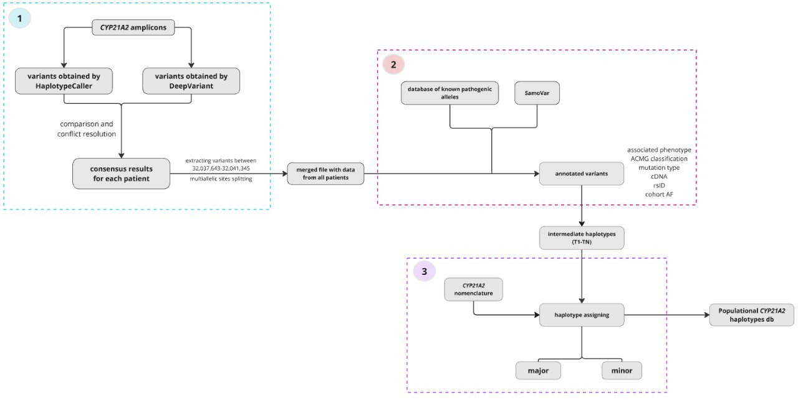
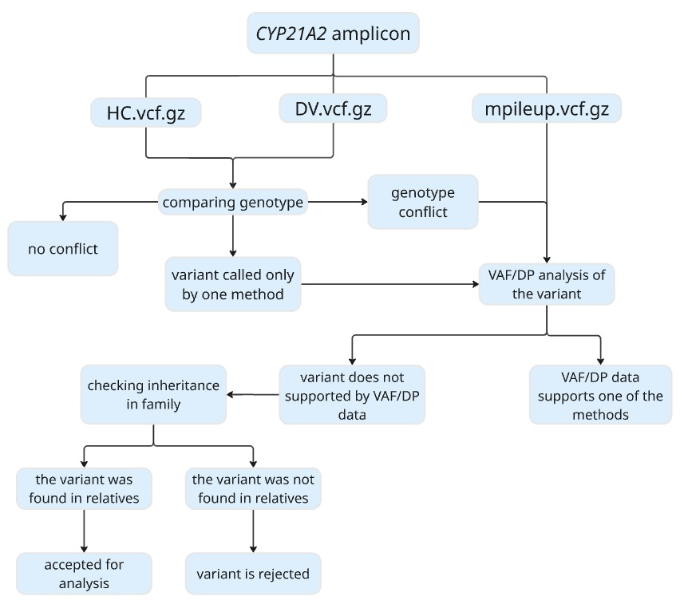

# *CYP21A2* haplotypes database
Database of the most common haplotypes found in patients with congenital adrenal hyperplasia 

## About the project

Accurate genetic diagnosis of congenital adrenal hyperplasia (CAH) is complicated due to the presence of a highly homologous pseudogene (*CYP21A1P*), located in close proximity to disease associated gene (*CYP21A2*). In short-read sequencing reads originating from the functional gene and the pseudogene are often indistinguishable, and, as a result, reads may align ambiguously or be misassigned to the wrong locus. Existing tools for working with highly homologous regions are developed mainly for genotyping pharmacogenes and are not suitable for diagnosing patients with CAH, because at the moment *CYP21A2* has no unified catalog of haplotypes that modern bioinformatic tools could readily incorporate. This project is dedicated to creating a populational database of *CYP21A2* haplotypes, that can be implemented in CAH diagnostic. 

## Workflow 

The database is formed on sequencing data from *CYP21A1P* amplicons of patients with CAH and their relatives and its processing consist of three main parts: variant calling and annotation, haplotypes extraction and haplotypes assigning:

## Variant calling 

For variant calling GATK HaplotypeCaller (version 4.5.0) and the DeepVariant (version 1.6.1) were used. However, two callers provided different outcomes both for the amount of variants called and their associated genotype in the patient. In order to obtain unambiguous results for each patient and to avoid missing any variants, it is necessary to reconcile and confirm the data from the two methods, based on alignment and inheritance data:

